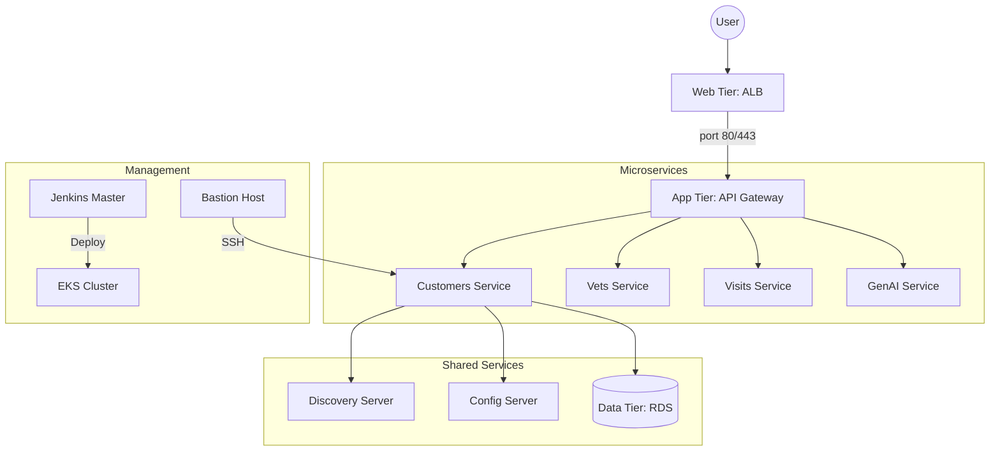

# Spring Petclinic Microservices Architecture

## Industrial Grade DevSecOps Blueprint

This project implements a high-availability, microservice-based architecture deployed on AWS via Terragrunt and Kubernetes (EKS).

## 1. High-Level Design
The system follows a tiered architecture designed for maximum security and scalability.

## 2. Infrastructure Tiers
| Tier | Description | Implementation |
| :--- | :--- | :--- |
| **Compute** | Managed Kubernetes (EKS) for app logic. | AWS EKS + Managed Node Groups |
| **Storage** | Relational data for microservices. | AWS RDS (MySQL/PostgreSQL) |
| **Network** | Isolated tiers for traffic control. | VPC with 3 Public / 3 Private subnets |
| **Security** | Identity-based access control. | Tiered Security Groups (Mgmt, Web, App, Data) |

## 3. Automation Stack
- **Provisioning:** [Terragrunt](./TERRAGRUNT_MIGRATION.md) (Terraform Wrapper)
- **Configuration:** Ansible (Masterless & Master-based flows)
- **CI/CD:** Jenkins (Dynamic Kubernetes Agents)
- **Orchestration:** Kubernetes (Kustomize for environment overlays)

## 4. Key Security Features
1. **Network Submergence:** All applications live in private subnets with no direct internet access.
2. **Identity Access:** Security groups reference other SGs rather than IP ranges.
3. **Secret Management:** (Planned) Integration with AWS Secrets Manager.
4. **Auditability:** Centralized logging via Zipkin/Prometheus (App Tier).

## 5. Directory Structure
- `/terraform`: Terragrunt/Terraform infrastructure code.
- `/k8s`: Kubernetes manifests (Kustomize base & overlays).
- `/jenkins`: Jenkins-as-Code (JCasC) and modular pipelines.
- `/ansible`: OS-level configuration and service setup.
- `/docs`: Detailed documentation for individual components.

---
*For a detailed log of the latest architectural refinements, see the [Terragrunt Migration Guide](./TERRAGRUNT_MIGRATION.md).*
