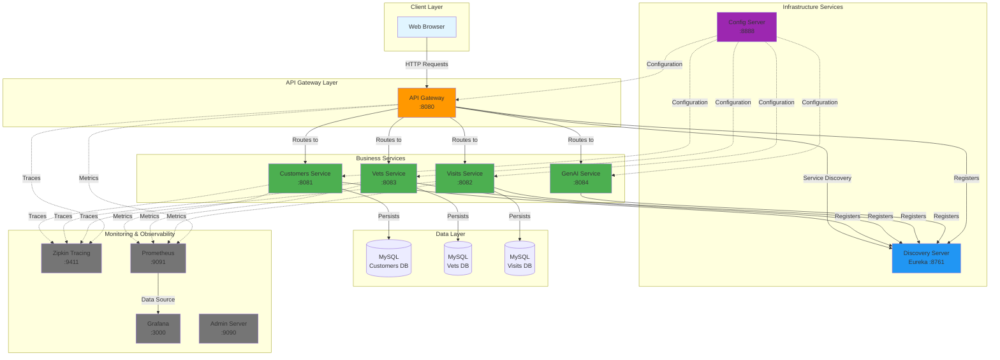
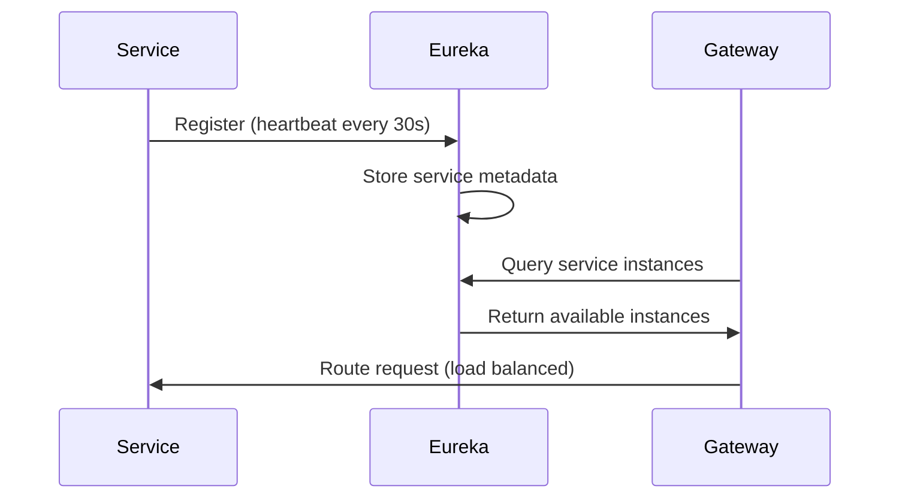
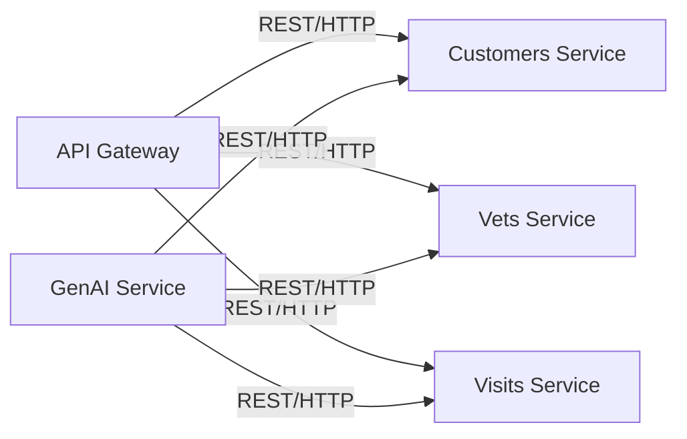
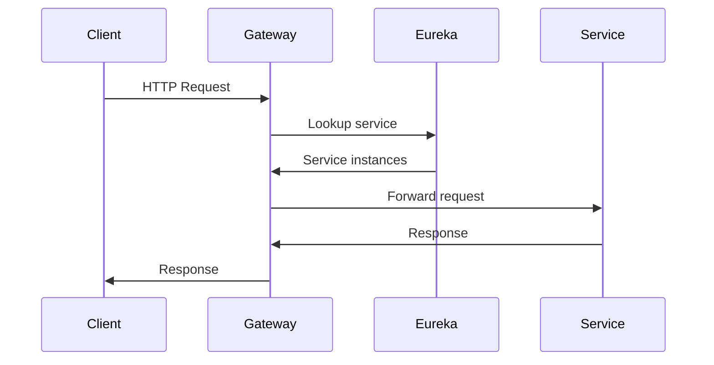
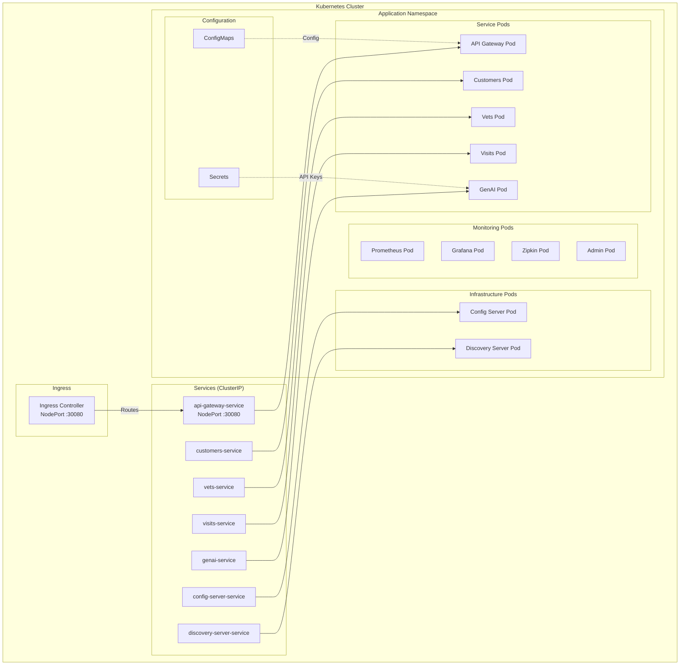
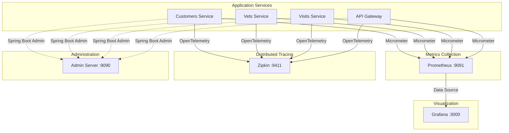
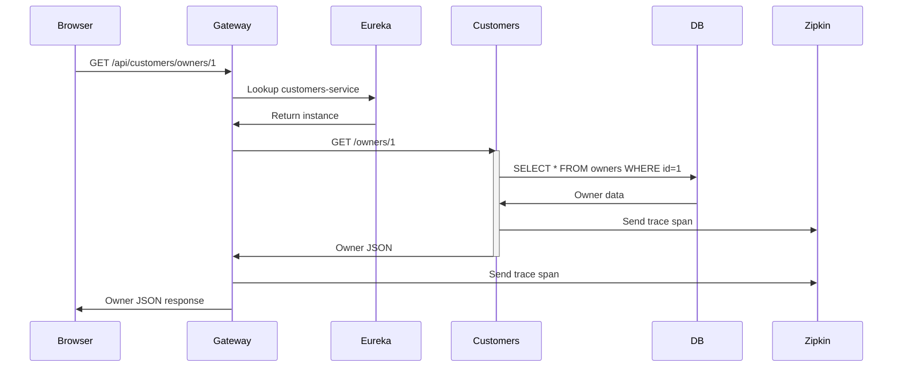
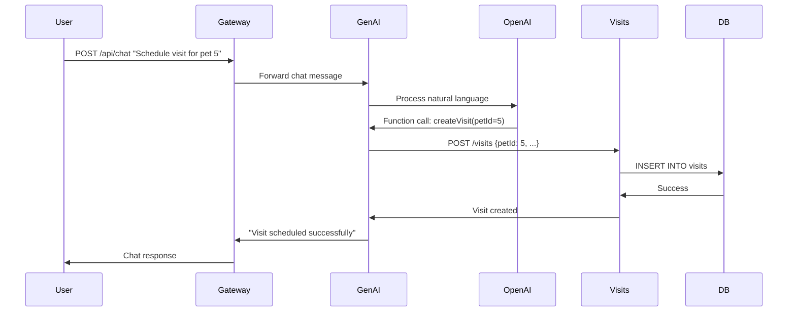

# Spring Petclinic Microservices Architecture

> [!NOTE]
> This document provides a comprehensive overview of the Spring Petclinic Microservices architecture, including service interactions, deployment topology, and infrastructure components.

## Table of Contents

1. [Architecture Overview](#architecture-overview)
2. [Microservices Components](#microservices-components)
3. [Infrastructure Services](#infrastructure-services)
4. [Service Communication](#service-communication)
5. [Kubernetes Deployment](#kubernetes-deployment)
6. [Monitoring & Observability](#monitoring--observability)

---

## Architecture Overview

The Spring Petclinic application follows a **microservices architecture** pattern, decomposing the monolithic application into independently deployable services that communicate via REST APIs.

### High-Level Architecture



---

## Microservices Components

### 1. **API Gateway** (Port 8080)

**Technology**: Spring Cloud Gateway

**Responsibilities**:
- Single entry point for all client requests
- Request routing to appropriate microservices
- Load balancing across service instances
- Circuit breaker implementation (Resilience4j)
- Cross-cutting concerns (authentication, logging, rate limiting)

**Key Features**:
- Routes requests based on path patterns
- Integrates with Eureka for service discovery
- Implements fallback mechanisms for resilience
- Serves the AngularJS frontend

**Routing Configuration**:
```yaml
# Example routes
/api/customers/** → Customers Service
/api/vets/**      → Vets Service
/api/visits/**    → Visits Service
/api/chat/**      → GenAI Service
```

---

### 2. **Customers Service** (Port 8081)

**Domain**: Customer and Pet Management

**Responsibilities**:
- Manage customer (owner) information
- Manage pet records
- CRUD operations for owners and pets
- Pet type management

**Database**: MySQL (customers schema)

**API Endpoints**:
- `GET /owners` - List all owners
- `GET /owners/{id}` - Get owner details
- `POST /owners` - Create new owner
- `PUT /owners/{id}` - Update owner
- `GET /owners/{id}/pets` - Get owner's pets
- `POST /owners/{id}/pets` - Add pet to owner

**Metrics**: `petclinic.owner`, `petclinic.pet`

---

### 3. **Vets Service** (Port 8083)

**Domain**: Veterinarian Management

**Responsibilities**:
- Manage veterinarian information
- Manage vet specialties
- Provide vet availability data

**Database**: MySQL (vets schema)

**API Endpoints**:
- `GET /vets` - List all veterinarians
- `GET /vets/{id}` - Get vet details

**Data Model**:
- Veterinarians with specialties (surgery, dentistry, radiology)

---

### 4. **Visits Service** (Port 8082)

**Domain**: Visit Management

**Responsibilities**:
- Manage pet visit records
- Track visit history
- Associate visits with pets

**Database**: MySQL (visits schema)

**API Endpoints**:
- `GET /visits` - List all visits
- `GET /visits/{id}` - Get visit details
- `POST /visits` - Create new visit
- `GET /pets/{petId}/visits` - Get visits for a pet

**Metrics**: `petclinic.visit`

---

### 5. **GenAI Service** (Port 8084)

**Domain**: AI-Powered Chatbot

**Technology**: Spring AI with OpenAI/Azure OpenAI

**Responsibilities**:
- Natural language interface to the application
- Query owners, vets, and visits using conversational AI
- Create and update records via chat commands
- Function calling to interact with other microservices

**Integration**:
- Calls Customers, Vets, and Visits services via REST
- Uses OpenAI GPT-4 or Azure OpenAI for language understanding
- Implements function calling for structured operations

**Example Queries**:
- "List all owners"
- "Are there any vets that specialize in surgery?"
- "Add a dog for Betty named Moopsie"
- "Which owners have dogs?"

**Configuration**:
```yaml
# Requires API keys
OPENAI_API_KEY or AZURE_OPENAI_KEY
AZURE_OPENAI_ENDPOINT (for Azure)
```

---

## Infrastructure Services

### 1. **Config Server** (Port 8888)

**Technology**: Spring Cloud Config

**Purpose**: Centralized configuration management

**Features**:
- Stores configuration in Git repository
- Provides configuration to all microservices
- Supports environment-specific configurations
- Hot reload of configuration changes

**Configuration Repository**: 
[spring-petclinic-microservices-config](https://github.com/spring-petclinic/spring-petclinic-microservices-config)

**Profiles**:
- `default` - Common configuration
- `docker` - Docker-specific settings
- `mysql` - MySQL database configuration
- `native` - Local Git repository

---

### 2. **Discovery Server (Eureka)** (Port 8761)

**Technology**: Netflix Eureka

**Purpose**: Service registry and discovery

**How It Works**:



**Service Registration**:
- Services register on startup
- Send heartbeats every 30 seconds
- Deregister on shutdown or failure
- Metadata includes: host, port, health status

**Service Discovery**:
- API Gateway queries Eureka for service locations
- Client-side load balancing
- Automatic failover to healthy instances

---

## Service Communication

### Communication Patterns

#### 1. **Synchronous REST Communication**



**Characteristics**:
- Request-response pattern
- JSON payloads
- HTTP/HTTPS protocol
- RESTful API design

#### 2. **Service Discovery Flow**



#### 3. **Circuit Breaker Pattern**

Implemented in API Gateway using Resilience4j:

```yaml
resilience4j:
  circuitbreaker:
    instances:
      customers:
        slidingWindowSize: 10
        failureRateThreshold: 50
        waitDurationInOpenState: 10000
```

**States**:
- **Closed**: Normal operation
- **Open**: Failures exceed threshold, requests fail fast
- **Half-Open**: Test if service recovered

---

## Kubernetes Deployment

### Kubernetes Architecture



### Deployment Specifications

| Service | Replicas | CPU Request | Memory Request | CPU Limit | Memory Limit |
|---------|----------|-------------|----------------|-----------|--------------|
| Config Server | 1 | 250m | 512Mi | 500m | 1Gi |
| Discovery Server | 1 | 250m | 512Mi | 500m | 1Gi |
| API Gateway | 2 | 500m | 768Mi | 1000m | 1.5Gi |
| Customers Service | 2 | 250m | 512Mi | 500m | 1Gi |
| Vets Service | 2 | 250m | 512Mi | 500m | 1Gi |
| Visits Service | 2 | 250m | 512Mi | 500m | 1Gi |
| GenAI Service | 1 | 500m | 768Mi | 1000m | 1.5Gi |

### Service Types

- **ClusterIP**: Internal services (Customers, Vets, Visits, Config, Discovery)
- **NodePort**: API Gateway (30080) - External access
- **LoadBalancer**: Optional for cloud deployments

### Health Checks

All services implement:

**Liveness Probe**:
```yaml
livenessProbe:
  httpGet:
    path: /actuator/health/liveness
    port: 8080
  initialDelaySeconds: 60
  periodSeconds: 10
```

**Readiness Probe**:
```yaml
readinessProbe:
  httpGet:
    path: /actuator/health/readiness
    port: 8080
  initialDelaySeconds: 30
  periodSeconds: 5
```

---

## Monitoring & Observability

### Observability Stack



### 1. **Prometheus** (Port 9091)

**Purpose**: Metrics collection and storage

**Metrics Collected**:
- JVM metrics (heap, threads, GC)
- HTTP request metrics
- Custom business metrics
- System metrics (CPU, memory)

**Scrape Configuration**:
```yaml
scrape_configs:
  - job_name: 'spring-petclinic'
    metrics_path: '/actuator/prometheus'
    static_configs:
      - targets:
        - 'api-gateway:8080'
        - 'customers-service:8081'
        - 'vets-service:8083'
        - 'visits-service:8082'
```

---

### 2. **Grafana** (Port 3000)

**Purpose**: Metrics visualization and dashboards

**Pre-configured Dashboards**:
- Spring Petclinic Metrics Dashboard
- JVM metrics
- HTTP request rates and latencies
- Custom business metrics

**Access**: http://localhost:3000
**Default Credentials**: admin/admin

---

### 3. **Zipkin** (Port 9411)

**Purpose**: Distributed tracing

**Features**:
- Trace requests across microservices
- Identify performance bottlenecks
- Visualize service dependencies
- Debug latency issues

**Trace Example**:
```
API Gateway → Customers Service → Database
     ↓
  Visits Service → Database
```

**Access**: http://localhost:9411/zipkin

---

### 4. **Spring Boot Admin** (Port 9090)

**Purpose**: Application monitoring and management

**Features**:
- Service health status
- Environment properties
- Log file viewing
- JVM metrics
- Thread dumps
- Heap dumps

**Access**: http://localhost:9090

---

## Data Flow Examples

### Example 1: Viewing Owner Details



### Example 2: Creating a Visit via GenAI



---

## Technology Stack Summary

| Layer | Technology |
|-------|------------|
| **Frontend** | AngularJS, Bootstrap |
| **API Gateway** | Spring Cloud Gateway |
| **Microservices** | Spring Boot 3.x, Java 17 |
| **Service Discovery** | Netflix Eureka |
| **Configuration** | Spring Cloud Config |
| **Database** | MySQL 8.x / HSQLDB (in-memory) |
| **AI Integration** | Spring AI, OpenAI/Azure OpenAI |
| **Metrics** | Micrometer, Prometheus |
| **Tracing** | OpenTelemetry, Zipkin |
| **Monitoring** | Grafana, Spring Boot Admin |
| **Circuit Breaker** | Resilience4j |
| **Container Runtime** | Docker, containerd |
| **Orchestration** | Kubernetes, Docker Compose |
| **Build Tool** | Maven |

---

## Deployment Options

### 1. **Local Development** (No Docker)

Start services in order:
1. Config Server
2. Discovery Server
3. Business Services (Customers, Vets, Visits, GenAI)
4. API Gateway
5. Optional: Monitoring services

### 2. **Docker Compose**

```bash
# Build images
./mvnw clean install -P buildDocker

# Start all services
docker compose up
```

**Access Points**:
- Application: http://localhost:8080
- Eureka: http://localhost:8761
- Grafana: http://localhost:3030
- Prometheus: http://localhost:9091
- Zipkin: http://localhost:9411

### 3. **Kubernetes**

```bash
# Apply all deployments
kubectl apply -f kubernetes/deployments/

# Access application
http://<node-ip>:30080
```

**Kubernetes Resources**:
- 12 Deployments
- 12 Services
- 1 Secret (API keys)
- ConfigMaps for configuration

---

## Port Reference

| Service | Port | Protocol | Access |
|---------|------|----------|--------|
| API Gateway | 8080 | HTTP | External |
| Config Server | 8888 | HTTP | Internal |
| Discovery Server | 8761 | HTTP | Internal/Dashboard |
| Customers Service | 8081 | HTTP | Internal |
| Vets Service | 8083 | HTTP | Internal |
| Visits Service | 8082 | HTTP | Internal |
| GenAI Service | 8084 | HTTP | Internal |
| Zipkin | 9411 | HTTP | Dashboard |
| Prometheus | 9091 | HTTP | Dashboard |
| Grafana | 3000 | HTTP | Dashboard |
| Admin Server | 9090 | HTTP | Dashboard |
| MySQL | 3306 | TCP | Internal |
| **Kubernetes NodePort** | 30080 | HTTP | External |

---

## Security Considerations

> [!IMPORTANT]
> **Production Deployment Checklist**

- [ ] Enable HTTPS/TLS for all external endpoints
- [ ] Implement authentication and authorization (OAuth2/JWT)
- [ ] Secure service-to-service communication
- [ ] Use Kubernetes Secrets for sensitive data
- [ ] Enable network policies to restrict pod communication
- [ ] Implement rate limiting on API Gateway
- [ ] Regular security updates and patching
- [ ] Enable audit logging
- [ ] Use non-root containers
- [ ] Implement RBAC in Kubernetes

---

## Scaling Strategies

### Horizontal Scaling

**Stateless Services** (can scale freely):
- API Gateway
- Customers Service
- Vets Service
- Visits Service

**Stateful Services** (limited scaling):
- Config Server (typically 1 instance)
- Discovery Server (can have 2-3 for HA)

### Kubernetes HPA Example

```yaml
apiVersion: autoscaling/v2
kind: HorizontalPodAutoscaler
metadata:
  name: api-gateway-hpa
spec:
  scaleTargetRef:
    apiVersion: apps/v1
    kind: Deployment
    name: api-gateway
  minReplicas: 2
  maxReplicas: 10
  metrics:
  - type: Resource
    resource:
      name: cpu
      target:
        type: Utilization
        averageUtilization: 70
```

---

## Troubleshooting Guide

### Common Issues

**1. Services not registering with Eureka**
```bash
# Check if Eureka is running
kubectl get pods -l app=discovery-server

# Check service logs
kubectl logs <pod-name>

# Verify network connectivity
kubectl exec <pod-name> -- curl http://discovery-server:8761
```

**2. API Gateway timeouts**
- Wait for services to register with Eureka (30-60 seconds)
- Check Eureka dashboard: http://localhost:8761
- Verify all services show as "UP"

**3. Database connection issues**
```bash
# Check MySQL is running
kubectl get pods -l app=mysql

# Verify connection from service
kubectl exec <service-pod> -- nc -zv mysql 3306
```

**4. GenAI Service errors**
- Verify API keys are set in Secrets
- Check OpenAI/Azure OpenAI quota
- Review logs for API errors

---

## Additional Resources

- **Source Code**: https://github.com/spring-petclinic/spring-petclinic-microservices
- **Config Repository**: https://github.com/spring-petclinic/spring-petclinic-microservices-config
- **Spring Cloud Documentation**: https://spring.io/projects/spring-cloud
- **Spring AI Documentation**: https://docs.spring.io/spring-ai/reference/

---

**Last Updated**: November 2025
