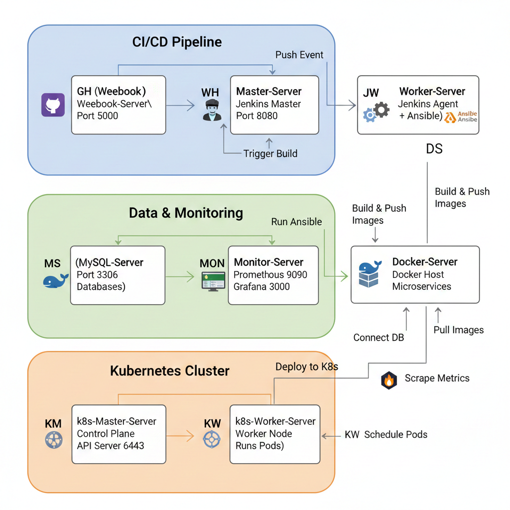

# Spring Petclinic Microservices - Complete Infrastructure Architecture

## 🏗️ **Infrastructure Overview**

Your Spring Petclinic project uses a **hybrid architecture** combining traditional CI/CD infrastructure with modern Kubernetes orchestration.

---

## 📊 **Server Architecture Diagram**
[text](scripts)  [text](ARCHITECTURE_QUICK_REF.md) [text](ARCHITECTURE.md) [text](CALICO_FIX.md) [text](INFRASTRUCTURE_ARCHITECTURE.md) [text](K8S_INSTALL_TROUBLESHOOTING.md) [text](K8S_QUICK_REFERENCE.md) [text](KUBECTL_CONFIG_FIX.md) [text](KUBERNETES_NOTES.md)
---

## 🖥️ **Server Breakdown**

### **1. Master-Server (Jenkins Master)**

**Purpose**: CI/CD orchestration and build management

**Components**:
- Jenkins Master (Port 8080)
- Build job definitions
- Pipeline orchestration

**Responsibilities**:
- Receives webhook triggers
- Schedules builds on Worker-Server
- Manages Jenkins plugins and configurations
- Stores build history and artifacts

**Connections**:
- ← Webhook-Server (receives build triggers)
- → Worker-Server (delegates build jobs)
- → Monitor-Server (sends metrics)

**Does NOT**:
- Build applications (delegated to Worker-Server)
- Run containers (delegated to Docker-Server)
- Run Kubernetes pods

---

### **2. Worker-Server (Jenkins Agent + Ansible)**

**Purpose**: Build execution and deployment automation

**Components**:
- Jenkins Agent (connected to Master-Server)
- Ansible (for MySQL configuration)
- Docker (for building images)
- Maven (for Java builds)
- kubectl (for K8s deployments)

**Responsibilities**:
- Executes Jenkins pipeline jobs
- Builds Spring Boot applications with Maven
- Builds Docker images
- Pushes images to Docker Hub
- Runs Ansible playbooks for MySQL setup
- Deploys applications to Kubernetes cluster

**Connections**:
- ← Master-Server (receives build jobs)
- → Docker-Server (SSH to deploy containers)
- → MySQL-Server (Ansible configuration)
- → k8s-Master-Server (kubectl commands)
- → Docker Hub (push images)

**Key Files**:
- `Jenkinsfile` - Defines the build pipeline
- `ansible/` - MySQL configuration playbooks
- `kubernetes/` - K8s deployment manifests

---

### **3. Docker-Server**

**Purpose**: Container runtime for traditional Docker deployments

**Components**:
- Docker Engine
- Running microservice containers
- Docker Compose (optional)

**Responsibilities**:
- Runs Spring Petclinic microservices as Docker containers
- Exposes services on various ports (8080-8089)
- Connects to MySQL-Server for data persistence
- Provides metrics to Prometheus

**How It's Used**:
1. Worker-Server builds Docker images
2. Worker-Server pushes images to Docker Hub
3. Worker-Server SSHs to Docker-Server
4. Runs `docker-compose up` or `docker run` commands
5. Containers start and connect to MySQL-Server

**Connections**:
- ← Worker-Server (SSH deployment)
- → MySQL-Server (database connections)
- → Monitor-Server (metrics scraping)

**Ports**:
- 8888: Config Server
- 8761: Discovery Server
- 8080: API Gateway
- 8081-8083: Microservices (customers, visits, vets)

---

### **4. MySQL-Server**

**Purpose**: Centralized database for all microservices

**Components**:
- MySQL 8.0
- Three databases: `customers`, `visits`, `vets`

**Responsibilities**:
- Stores application data
- Provides database services to microservices
- Configured via Ansible from Worker-Server

**Connections**:
- ← Worker-Server (Ansible configuration)
- ← Docker-Server (microservice connections)
- ← k8s-Worker-Server (pod connections)

**Configuration**:
- Ansible playbook: `ansible/mysql_setup.yml`
- Databases created automatically
- User: `petclinic_user`
- Accessible from all servers

---

### **5. Monitor-Server (Prometheus + Grafana)**

**Purpose**: Metrics collection and visualization

**Components**:
- Prometheus (Port 9090) - Metrics collection
- Grafana (Port 3000) - Dashboards
- Node Exporter (Port 9100) - System metrics

**Responsibilities**:
- Scrapes metrics from all servers
- Stores time-series data
- Provides dashboards for monitoring
- Alerts on issues

**Scrapes Metrics From**:
- Docker-Server (Spring Boot Actuator endpoints)
- k8s-Master-Server (Kubernetes metrics)
- k8s-Worker-Server (Node metrics, pod metrics)
- Itself (Node Exporter)

**Configuration**:
- `prometheus/prometheus.yml` - Scrape targets
- `grafana/` - Dashboard definitions

---

### **6. Webhook-Server**

**Purpose**: GitHub webhook receiver and Jenkins trigger

**Components**:
- Python Flask application (Port 5000)
- Webhook receiver script

**Responsibilities**:
- Receives GitHub push events
- Validates webhook signatures
- Triggers Jenkins builds via API
- Logs webhook events

**Flow**:
1. Developer pushes code to GitHub
2. GitHub sends webhook to Webhook-Server
3. Webhook-Server validates and triggers Jenkins
4. Jenkins starts build pipeline on Worker-Server

**Connections**:
- ← GitHub (webhook events)
- → Master-Server (Jenkins API calls)

---

### **7. k8s-Master-Server (Kubernetes Control Plane)**

**Purpose**: Kubernetes cluster management and orchestration

**Components**:
- kube-apiserver (Port 6443) - API endpoint
- etcd - Cluster state storage
- kube-scheduler - Pod scheduling
- kube-controller-manager - Cluster controllers
- Calico CNI - Networking

**Responsibilities**:
- Manages Kubernetes cluster state
- Schedules pods on worker nodes
- Handles API requests from kubectl
- Manages cluster networking via Calico
- Stores cluster configuration in etcd

**Connections**:
- ← Worker-Server (kubectl commands)
- → k8s-Worker-Server (pod scheduling)
- → Monitor-Server (metrics export)

**Does NOT**:
- Run application pods (delegated to k8s-Worker-Server)
- Build Docker images
- Store application data

---

### **8. k8s-Worker-Server**

**Purpose**: Kubernetes workload execution

**Components**:
- kubelet - Node agent
- kube-proxy - Network proxy
- containerd - Container runtime
- Calico node - CNI networking

**Responsibilities**:
- Runs application pods
- Pulls Docker images from Docker Hub
- Connects pods to MySQL-Server
- Provides pod metrics to Prometheus
- Executes container workloads

**How Pods Run**:
1. Worker-Server runs `kubectl apply -f kubernetes/`
2. k8s-Master-Server receives deployment request
3. k8s-Master-Server schedules pods on k8s-Worker-Server
4. k8s-Worker-Server pulls images from Docker Hub
5. Pods start and connect to MySQL-Server
6. Services expose pods via NodePort/LoadBalancer

**Connections**:
- ← k8s-Master-Server (receives pod assignments)
- → MySQL-Server (pod database connections)
- → Docker Hub (image pulls)
- → Monitor-Server (metrics export)

---

## 🔄 **Complete Deployment Flow**

### **Traditional Docker Deployment (via Jenkins)**

```
1. Developer pushes code to GitHub
   ↓
2. GitHub sends webhook to Webhook-Server
   ↓
3. Webhook-Server triggers Jenkins on Master-Server
   ↓
4. Master-Server schedules job on Worker-Server
   ↓
5. Worker-Server executes Jenkinsfile:
   - Checkout code from GitHub
   - Build with Maven
   - Build Docker images
   - Push images to Docker Hub
   - SSH to Docker-Server
   - Run docker-compose up
   ↓
6. Docker-Server pulls images and starts containers
   ↓
7. Containers connect to MySQL-Server
   ↓
8. Monitor-Server scrapes metrics
```

### **Kubernetes Deployment (via Jenkins)**

```
1. Developer pushes code to GitHub
   ↓
2. GitHub sends webhook to Webhook-Server
   ↓
3. Webhook-Server triggers Jenkins on Master-Server
   ↓
4. Master-Server schedules job on Worker-Server
   ↓
5. Worker-Server executes Jenkinsfile:
   - Checkout code from GitHub
   - Build with Maven
   - Build Docker images
   - Push images to Docker Hub
   - Run kubectl apply -f kubernetes/
   ↓
6. kubectl sends deployment to k8s-Master-Server
   ↓
7. k8s-Master-Server schedules pods on k8s-Worker-Server
   ↓
8. k8s-Worker-Server pulls images from Docker Hub
   ↓
9. Pods start and connect to MySQL-Server
   ↓
10. Monitor-Server scrapes metrics from pods
```

---

## 🔗 **How Kubernetes Connects to Other Servers**

### **K8s → Docker-Server: NO DIRECT CONNECTION**

**Important**: Kubernetes does **NOT** connect to Docker-Server directly!

- Docker-Server is for **traditional Docker deployments**
- k8s-Worker-Server is for **Kubernetes deployments**
- They are **separate deployment targets**

**Two Deployment Modes**:
1. **Docker Mode**: Deploy to Docker-Server using `docker-compose`
2. **Kubernetes Mode**: Deploy to k8s cluster using `kubectl`

### **K8s → MySQL-Server: Database Connections**

**Connection Method**:
- Pods running on k8s-Worker-Server connect to MySQL-Server
- Connection string: `jdbc:mysql://mysql-server-ip:3306/database`
- Configured via environment variables in Kubernetes deployments

**Example**:
```yaml
# kubernetes/customers-service-deployment.yaml
env:
  - name: SPRING_DATASOURCE_URL
    value: "jdbc:mysql://10.0.1.50:3306/customers"
  - name: SPRING_DATASOURCE_USERNAME
    value: "petclinic_user"
```

### **K8s → Monitor-Server: Metrics Export**

**Connection Method**:
- Prometheus on Monitor-Server scrapes metrics from:
  - k8s-Master-Server API (cluster metrics)
  - k8s-Worker-Server Node Exporter (node metrics)
  - Pods via Service endpoints (application metrics)

**Prometheus Configuration**:
```yaml
# prometheus/prometheus.yml
scrape_configs:
  - job_name: 'kubernetes-nodes'
    static_configs:
      - targets: ['k8s-master-ip:10250', 'k8s-worker-ip:10250']
  
  - job_name: 'kubernetes-pods'
    kubernetes_sd_configs:
      - role: pod
```

### **Worker-Server → k8s-Master-Server: kubectl Commands**

**Connection Method**:
- Worker-Server has kubectl configured
- kubectl connects to k8s-Master-Server API (port 6443)
- Uses kubeconfig with authentication token

**Jenkinsfile Example**:
```groovy
stage('Deploy to Kubernetes') {
    steps {
        sh '''
            kubectl apply -f kubernetes/
            kubectl rollout status deployment/customers-service
        '''
    }
}
```

---

## 🌐 **Network Architecture**

### **VPC Layout**

```
VPC: 10.0.0.0/16
├── Public Subnet 1: 10.0.1.0/24
│   ├── Master-Server (Jenkins)      - 10.0.1.10
│   ├── Worker-Server (Agent)        - 10.0.1.20
│   ├── Docker-Server                - 10.0.1.30
│   ├── MySQL-Server                 - 10.0.1.40
│   ├── Monitor-Server               - 10.0.1.50
│   ├── Webhook-Server               - 10.0.1.60
│   ├── k8s-Master-Server            - 10.0.1.70
│   └── k8s-Worker-Server            - 10.0.1.80
```

### **Security Groups**

**Master-Server SG**:
- Inbound: 8080 (Jenkins UI), 22 (SSH)
- Outbound: All

**Worker-Server SG**:
- Inbound: 22 (SSH), 50000 (Jenkins agent)
- Outbound: All

**Docker-Server SG**:
- Inbound: 22 (SSH), 8080-8089 (services)
- Outbound: All

**MySQL-Server SG**:
- Inbound: 3306 (MySQL from all servers)
- Outbound: All

**Monitor-Server SG**:
- Inbound: 9090 (Prometheus), 3000 (Grafana), 22 (SSH)
- Outbound: All

**k8s-Master-Server SG**:
- Inbound: 6443 (API), 2379-2380 (etcd), 10250-10252 (kubelet), 22 (SSH)
- Outbound: All

**k8s-Worker-Server SG**:
- Inbound: 10250 (kubelet), 30000-32767 (NodePort), 22 (SSH)
- Outbound: All

---

## 📦 **Data Flow**

### **Application Data**
```
User Request
  ↓
API Gateway (Docker-Server or k8s-Worker-Server)
  ↓
Microservices (customers/visits/vets)
  ↓
MySQL-Server (databases)
```

### **Metrics Data**
```
Application (Docker-Server or k8s-Worker-Server)
  ↓ (Actuator endpoints)
Prometheus (Monitor-Server)
  ↓ (queries)
Grafana (Monitor-Server)
  ↓ (dashboards)
User
```

### **Build Artifacts**
```
GitHub
  ↓ (webhook)
Webhook-Server
  ↓ (trigger)
Jenkins Master-Server
  ↓ (schedule)
Jenkins Worker-Server
  ↓ (build)
Docker Images
  ↓ (push)
Docker Hub
  ↓ (pull)
Docker-Server OR k8s-Worker-Server
```

---

## 🎯 **Key Concepts**

### **1. Separation of Concerns**

- **CI/CD Infrastructure**: Master-Server, Worker-Server, Webhook-Server
- **Runtime Infrastructure**: Docker-Server OR Kubernetes Cluster
- **Data Infrastructure**: MySQL-Server
- **Monitoring Infrastructure**: Monitor-Server

### **2. Two Deployment Modes**

**Mode 1: Traditional Docker**
- Deploy to Docker-Server
- Use docker-compose
- Direct container management

**Mode 2: Kubernetes**
- Deploy to k8s cluster
- Use kubectl
- Orchestrated pod management

### **3. Kubernetes Independence**

- K8s cluster is **self-contained**
- Does NOT depend on Docker-Server
- Pulls images from Docker Hub (same as Docker-Server)
- Connects to MySQL-Server (same as Docker-Server)
- Monitored by Prometheus (same as Docker-Server)

### **4. Worker-Server as Bridge**

Worker-Server is the **bridge** between CI/CD and runtime:
- Builds applications
- Pushes to Docker Hub
- Deploys to Docker-Server (SSH + docker commands)
- Deploys to K8s (kubectl commands)
- Configures MySQL (Ansible)

---

## 🔧 **Configuration Files**

### **Terraform** (Infrastructure)
```
terraform/app/main.tf
├── Master-Server (Jenkins)
├── Worker-Server (Agent + Ansible)
├── Docker-Server
├── MySQL-Server
├── Monitor-Server
├── Webhook-Server
├── k8s-Master-Server
└── k8s-Worker-Server
```

### **Ansible** (MySQL Configuration)
```
ansible/
├── inventory.ini (MySQL-Server)
├── mysql_setup.yml
└── roles/mysql_petclinic/
```

### **Kubernetes** (K8s Deployments)
```
kubernetes/
├── config-server-deployment.yaml
├── discovery-server-deployment.yaml
├── customers-service-deployment.yaml
├── visits-service-deployment.yaml
├── vets-service-deployment.yaml
└── api-gateway-deployment.yaml
```

### **Docker** (Traditional Deployments)
```
docker/
├── docker-compose.yml
├── Dockerfile
└── prometheus/
```

---

## 💡 **Summary**

Your infrastructure uses a **hybrid approach**:

1. **CI/CD Pipeline**: Jenkins (Master + Worker) orchestrates builds
2. **Build Process**: Worker-Server builds and pushes Docker images
3. **Deployment Options**:
   - **Option A**: Deploy to Docker-Server (traditional)
   - **Option B**: Deploy to Kubernetes cluster (modern)
4. **Shared Services**:
   - MySQL-Server (database for both modes)
   - Monitor-Server (monitoring for both modes)
5. **Kubernetes**: Self-contained cluster that pulls images and connects to MySQL

**Kubernetes does NOT connect to Docker-Server** - they are alternative deployment targets! 🚀
