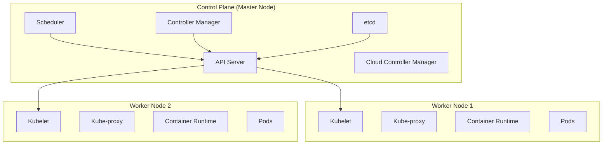

# Kubernetes Complete Study Notes

> [!NOTE]
> This document provides comprehensive notes on Kubernetes architecture, components, and concepts to help you understand container orchestration.

## Table of Contents
1. [What is Kubernetes?](#what-is-kubernetes)
2. [Kubernetes Architecture](#kubernetes-architecture)
3. [Control Plane Components](#control-plane-components)
4. [Node Components](#node-components)
5. [Kubernetes Objects](#kubernetes-objects)
6. [Networking](#networking)
7. [Storage](#storage)
8. [Configuration & Secrets](#configuration--secrets)
9. [Workload Management](#workload-management)
10. [Service Discovery & Load Balancing](#service-discovery--load-balancing)

---

## What is Kubernetes?

**Kubernetes (K8s)** is an open-source container orchestration platform that automates:
- **Deployment** - Rolling out containerized applications
- **Scaling** - Automatically scaling applications up/down
- **Management** - Managing containerized applications across clusters

### Key Benefits
- ✅ **High Availability** - No downtime through self-healing
- ✅ **Scalability** - Horizontal and vertical scaling
- ✅ **Disaster Recovery** - Backup and restore capabilities
- ✅ **Portability** - Run anywhere (cloud, on-prem, hybrid)
- ✅ **Declarative Configuration** - Define desired state, K8s makes it happen

---

## Kubernetes Architecture

Kubernetes follows a **master-worker architecture** with two main node types:

### Visual Architecture




### Architecture Overview

| Component Type | Location | Purpose |
|---------------|----------|---------|
| **Control Plane** | Master Node | Manages the cluster, makes decisions |
| **Worker Nodes** | Worker Nodes | Run application workloads (Pods) |
| **etcd** | Master Node | Stores cluster state |
| **API Server** | Master Node | Frontend for Kubernetes control plane |

---

## Control Plane Components

The **Control Plane** makes global decisions about the cluster and detects/responds to cluster events.

### 1. **kube-apiserver**

**The API Server is the frontend of Kubernetes.**

- **Purpose**: Exposes the Kubernetes API
- **Function**: Entry point for all REST commands used to control the cluster
- **Communication**: All components communicate through the API server
- **Port**: `6443` (HTTPS)

**Key Features:**
- Validates and configures data for API objects (pods, services, etc.)
- Serves as the gateway for `kubectl` commands
- Authenticates and authorizes requests
- Processes RESTful requests and updates etcd

```bash
# Check API server status
kubectl get pods -n kube-system -l component=kube-apiserver

# View API server logs
kubectl logs -n kube-system kube-apiserver-<master-node-name>
```

---

### 2. **etcd**

**Consistent and highly-available key-value store.**

- **Purpose**: Stores all cluster data (configuration, state, metadata)
- **Type**: Distributed key-value database
- **Port**: `2379-2380`
- **Consistency**: Uses Raft consensus algorithm

**What etcd Stores:**
- Cluster configuration
- Current state of all objects
- Metadata about nodes, pods, services
- Secrets and ConfigMaps

> [!IMPORTANT]
> **etcd is the single source of truth for the cluster.** Backing up etcd is critical for disaster recovery.

```bash
# Check etcd health
kubectl get pods -n kube-system -l component=etcd

# Backup etcd (on master node)
sudo ETCDCTL_API=3 etcdctl snapshot save /backup/etcd-snapshot.db \
  --endpoints=https://127.0.0.1:2379 \
  --cacert=/etc/kubernetes/pki/etcd/ca.crt \
  --cert=/etc/kubernetes/pki/etcd/server.crt \
  --key=/etc/kubernetes/pki/etcd/server.key
```

---

### 3. **kube-scheduler**

**Watches for newly created Pods and assigns them to nodes.**

- **Purpose**: Decides which node a Pod should run on
- **Port**: `10259`
- **Factors Considered**:
  - Resource requirements (CPU, memory)
  - Hardware/software constraints
  - Affinity/anti-affinity rules
  - Data locality
  - Taints and tolerations

**Scheduling Process:**
1. **Filtering**: Finds nodes that can run the Pod
2. **Scoring**: Ranks viable nodes
3. **Binding**: Assigns Pod to the highest-scored node

```bash
# Check scheduler status
kubectl get pods -n kube-system -l component=kube-scheduler

# View scheduler logs
kubectl logs -n kube-system kube-scheduler-<master-node-name>
```

---

### 4. **kube-controller-manager**

**Runs controller processes that regulate the cluster state.**

- **Purpose**: Ensures desired state matches actual state
- **Port**: `10257`
- **Controllers Include**:
  - **Node Controller**: Monitors node health
  - **Replication Controller**: Maintains correct number of pods
  - **Endpoints Controller**: Populates Endpoints objects
  - **Service Account Controller**: Creates default service accounts

**How Controllers Work:**
- Watch the cluster state via API server
- Make changes to move current state toward desired state
- Run in a continuous reconciliation loop

```bash
# Check controller manager status
kubectl get pods -n kube-system -l component=kube-controller-manager

# View all controllers
kubectl get componentstatuses
```

---

### 5. **cloud-controller-manager** (Optional)

**Integrates with cloud provider APIs.**

- **Purpose**: Manages cloud-specific control logic
- **Cloud Controllers**:
  - **Node Controller**: Checks if a node has been deleted in the cloud
  - **Route Controller**: Sets up routes in cloud infrastructure
  - **Service Controller**: Creates/updates cloud load balancers

> [!NOTE]
> Only needed when running Kubernetes on cloud providers (AWS, GCP, Azure).

---

## Node Components

**Node components run on every node**, maintaining running pods and providing the Kubernetes runtime environment.

### 1. **kubelet**

**The primary node agent that runs on each node.**

- **Purpose**: Ensures containers are running in Pods
- **Port**: `10250`
- **Responsibilities**:
  - Registers node with API server
  - Watches for Pod assignments
  - Starts/stops containers via container runtime
  - Reports node and Pod status
  - Runs liveness/readiness probes

**How kubelet Works:**
1. Receives Pod specifications (PodSpecs) from API server
2. Ensures containers described in PodSpecs are running and healthy
3. Reports back to API server

```bash
# Check kubelet status
sudo systemctl status kubelet

# View kubelet logs
sudo journalctl -u kubelet -f

# Check kubelet configuration
sudo cat /var/lib/kubelet/config.yaml
```

---

### 2. **kube-proxy**

**Network proxy that maintains network rules on nodes.**

- **Purpose**: Enables network communication to Pods
- **Port**: Part of `30000-32767` (NodePort range)
- **Modes**:
  - **iptables** (default): Uses iptables rules for routing
  - **IPVS**: Uses IP Virtual Server for better performance
  - **userspace**: Legacy mode

**Functions:**
- Implements Kubernetes Service abstraction
- Forwards traffic to appropriate Pods
- Load balances across Pod replicas

```bash
# Check kube-proxy status
kubectl get pods -n kube-system -l k8s-app=kube-proxy

# View kube-proxy configuration
kubectl get configmap -n kube-system kube-proxy -o yaml
```

---

### 3. **Container Runtime**

**Software responsible for running containers.**

- **Purpose**: Pulls images and runs containers
- **Supported Runtimes**:
  - **containerd** (most common)
  - **CRI-O**
  - **Docker** (deprecated in K8s 1.24+)

**Container Runtime Interface (CRI):**
- Standard interface between kubelet and container runtime
- Allows pluggable container runtimes

```bash
# Check containerd status
sudo systemctl status containerd

# List running containers (containerd)
sudo crictl ps

# List container images
sudo crictl images
```

---

## Kubernetes Objects

Kubernetes objects are **persistent entities** that represent the state of your cluster.

### Core Object Types

| Object | Purpose | Example Use Case |
|--------|---------|------------------|
| **Pod** | Smallest deployable unit | Running a single container or tightly coupled containers |
| **Service** | Stable network endpoint | Exposing Pods to network traffic |
| **Deployment** | Manages replica sets | Deploying stateless applications |
| **StatefulSet** | Manages stateful apps | Databases, message queues |
| **DaemonSet** | Runs on all nodes | Logging agents, monitoring |
| **Job** | Run-to-completion tasks | Batch processing |
| **CronJob** | Scheduled jobs | Periodic backups |

---

### 1. **Pods**

**The smallest and simplest Kubernetes object.**


- **Definition**: A group of one or more containers with shared storage/network
- **Lifecycle**: Ephemeral - Pods are mortal
- **IP Address**: Each Pod gets a unique IP

**Pod Characteristics:**
- Containers in a Pod share:
  - Network namespace (same IP)
  - Storage volumes
  - IPC namespace
- Usually run a single container (sidecar pattern for multiple)

```yaml
apiVersion: v1
kind: Pod
metadata:
  name: nginx-pod
  labels:
    app: nginx
spec:
  containers:
  - name: nginx
    image: nginx:1.21
    ports:
    - containerPort: 80
```

```bash
# Create a Pod
kubectl apply -f pod.yaml

# List Pods
kubectl get pods

# Describe Pod
kubectl describe pod nginx-pod

# View Pod logs
kubectl logs nginx-pod

# Execute command in Pod
kubectl exec -it nginx-pod -- /bin/bash
```

---

### 2. **Services**

**An abstract way to expose an application running on Pods.**


- **Purpose**: Provides stable networking for Pods
- **Why Needed**: Pod IPs change when Pods restart
- **Service Types**:

| Type | Description | Use Case |
|------|-------------|----------|
| **ClusterIP** | Internal cluster IP (default) | Internal microservices |
| **NodePort** | Exposes on each node's IP at a static port | Development/testing |
| **LoadBalancer** | Creates external load balancer | Production external access |
| **ExternalName** | Maps to external DNS name | External services |

```yaml
apiVersion: v1
kind: Service
metadata:
  name: nginx-service
spec:
  type: NodePort
  selector:
    app: nginx
  ports:
  - port: 80        # Service port
    targetPort: 80  # Container port
    nodePort: 30080 # External port (30000-32767)
```

```bash
# Create Service
kubectl apply -f service.yaml

# List Services
kubectl get services

# Describe Service
kubectl describe service nginx-service

# Get Service endpoints
kubectl get endpoints nginx-service
```

---

### 3. **Deployments**

**Provides declarative updates for Pods and ReplicaSets.**


- **Purpose**: Manages stateless applications
- **Features**:
  - Rolling updates
  - Rollback capability
  - Scaling
  - Self-healing

**Deployment Strategy:**
- **RollingUpdate** (default): Gradually replaces old Pods
- **Recreate**: Terminates all old Pods before creating new ones

```yaml
apiVersion: apps/v1
kind: Deployment
metadata:
  name: nginx-deployment
spec:
  replicas: 3
  selector:
    matchLabels:
      app: nginx
  template:
    metadata:
      labels:
        app: nginx
    spec:
      containers:
      - name: nginx
        image: nginx:1.21
        ports:
        - containerPort: 80
        resources:
          requests:
            memory: "64Mi"
            cpu: "250m"
          limits:
            memory: "128Mi"
            cpu: "500m"
```

```bash
# Create Deployment
kubectl apply -f deployment.yaml

# List Deployments
kubectl get deployments

# Scale Deployment
kubectl scale deployment nginx-deployment --replicas=5

# Update image (rolling update)
kubectl set image deployment/nginx-deployment nginx=nginx:1.22

# Rollback to previous version
kubectl rollout undo deployment/nginx-deployment

# View rollout history
kubectl rollout history deployment/nginx-deployment

# Check rollout status
kubectl rollout status deployment/nginx-deployment
```

---

### 4. **StatefulSets**

**Manages stateful applications.**

- **Purpose**: For applications requiring stable identity and storage
- **Guarantees**:
  - Stable, unique network identifiers
  - Stable, persistent storage
  - Ordered deployment and scaling
  - Ordered, automated rolling updates

**Use Cases:**
- Databases (MySQL, PostgreSQL, MongoDB)
- Message queues (Kafka, RabbitMQ)
- Distributed systems requiring stable identity

```yaml
apiVersion: apps/v1
kind: StatefulSet
metadata:
  name: mysql
spec:
  serviceName: mysql
  replicas: 3
  selector:
    matchLabels:
      app: mysql
  template:
    metadata:
      labels:
        app: mysql
    spec:
      containers:
      - name: mysql
        image: mysql:8.0
        ports:
        - containerPort: 3306
        volumeMounts:
        - name: data
          mountPath: /var/lib/mysql
  volumeClaimTemplates:
  - metadata:
      name: data
    spec:
      accessModes: [ "ReadWriteOnce" ]
      resources:
        requests:
          storage: 10Gi
```

---

### 5. **DaemonSets**

**Ensures all (or some) nodes run a copy of a Pod.**

- **Purpose**: Run system daemons on every node
- **Use Cases**:
  - Log collection (Fluentd, Logstash)
  - Monitoring agents (Prometheus Node Exporter)
  - Network plugins (Calico, Flannel)

```yaml
apiVersion: apps/v1
kind: DaemonSet
metadata:
  name: fluentd
spec:
  selector:
    matchLabels:
      name: fluentd
  template:
    metadata:
      labels:
        name: fluentd
    spec:
      containers:
      - name: fluentd
        image: fluentd:latest
```

---

### 6. **Jobs & CronJobs**

**Jobs**: Run tasks to completion
**CronJobs**: Run Jobs on a schedule

```yaml
# Job
apiVersion: batch/v1
kind: Job
metadata:
  name: backup-job
spec:
  template:
    spec:
      containers:
      - name: backup
        image: backup-tool:latest
        command: ["./backup.sh"]
      restartPolicy: OnFailure

---
# CronJob
apiVersion: batch/v1
kind: CronJob
metadata:
  name: daily-backup
spec:
  schedule: "0 2 * * *"  # 2 AM daily
  jobTemplate:
    spec:
      template:
        spec:
          containers:
          - name: backup
            image: backup-tool:latest
            command: ["./backup.sh"]
          restartPolicy: OnFailure
```

---

## Networking


Kubernetes networking follows these principles:

### Networking Rules

1. **Pod-to-Pod**: All Pods can communicate without NAT
2. **Node-to-Pod**: Nodes can communicate with all Pods without NAT
3. **Pod IP**: Each Pod gets its own IP address

### Container Network Interface (CNI)

**CNI plugins provide networking capabilities:**

| Plugin | Description | Use Case |
|--------|-------------|----------|
| **Calico** | L3 networking with BGP | Production, network policies |
| **Flannel** | Simple overlay network | Development, simple setups |
| **Weave** | Mesh network | Multi-cloud |
| **Cilium** | eBPF-based networking | Advanced security, observability |

```bash
# Install Calico
kubectl apply -f https://raw.githubusercontent.com/projectcalico/calico/v3.27.2/manifests/tigera-operator.yaml
kubectl apply -f https://raw.githubusercontent.com/projectcalico/calico/v3.27.2/manifests/custom-resources.yaml

# Check CNI pods
kubectl get pods -n kube-system -l k8s-app=calico-node

# Verify networking
kubectl get pods -n calico-system
```

### Network Policies

**Control traffic flow between Pods.**

```yaml
apiVersion: networking.k8s.io/v1
kind: NetworkPolicy
metadata:
  name: allow-frontend
spec:
  podSelector:
    matchLabels:
      role: backend
  ingress:
  - from:
    - podSelector:
        matchLabels:
          role: frontend
    ports:
    - protocol: TCP
      port: 8080
```

---

## Storage


Kubernetes provides abstractions for managing storage.

### Storage Concepts

| Concept | Description |
|---------|-------------|
| **Volume** | Directory accessible to containers in a Pod |
| **PersistentVolume (PV)** | Cluster-level storage resource |
| **PersistentVolumeClaim (PVC)** | Request for storage by a user |
| **StorageClass** | Defines types of storage available |

### Volume Types

```yaml
# emptyDir - temporary storage
volumes:
- name: cache
  emptyDir: {}

# hostPath - node's filesystem
volumes:
- name: data
  hostPath:
    path: /data
    type: Directory

# configMap - configuration data
volumes:
- name: config
  configMap:
    name: app-config

# secret - sensitive data
volumes:
- name: secrets
  secret:
    secretName: app-secrets
```

### Persistent Volumes

```yaml
# PersistentVolume
apiVersion: v1
kind: PersistentVolume
metadata:
  name: pv-data
spec:
  capacity:
    storage: 10Gi
  accessModes:
  - ReadWriteOnce
  persistentVolumeReclaimPolicy: Retain
  storageClassName: standard
  hostPath:
    path: /mnt/data

---
# PersistentVolumeClaim
apiVersion: v1
kind: PersistentVolumeClaim
metadata:
  name: pvc-data
spec:
  accessModes:
  - ReadWriteOnce
  resources:
    requests:
      storage: 10Gi
  storageClassName: standard
```

**Access Modes:**
- `ReadWriteOnce` (RWO): Single node read-write
- `ReadOnlyMany` (ROX): Multiple nodes read-only
- `ReadWriteMany` (RWX): Multiple nodes read-write

---

## Configuration & Secrets

### ConfigMaps

**Store non-confidential configuration data.**

```yaml
apiVersion: v1
kind: ConfigMap
metadata:
  name: app-config
data:
  database_url: "mysql://db:3306"
  log_level: "info"
  config.json: |
    {
      "feature_flags": {
        "new_ui": true
      }
    }
```

```bash
# Create ConfigMap from literal
kubectl create configmap app-config --from-literal=key1=value1

# Create from file
kubectl create configmap app-config --from-file=config.json

# Use in Pod
spec:
  containers:
  - name: app
    envFrom:
    - configMapRef:
        name: app-config
```

---

### Secrets

**Store sensitive information (passwords, tokens, keys).**

```yaml
apiVersion: v1
kind: Secret
metadata:
  name: db-secret
type: Opaque
data:
  username: YWRtaW4=  # base64 encoded
  password: cGFzc3dvcmQ=  # base64 encoded
```

```bash
# Create Secret
kubectl create secret generic db-secret \
  --from-literal=username=admin \
  --from-literal=password=password

# Use in Pod
spec:
  containers:
  - name: app
    env:
    - name: DB_USER
      valueFrom:
        secretKeyRef:
          name: db-secret
          key: username
```

> [!CAUTION]
> Secrets are base64 encoded, NOT encrypted by default. Use encryption at rest for production.

---

## Workload Management

### Resource Requests & Limits

**Control resource allocation for containers.**

```yaml
resources:
  requests:
    memory: "64Mi"   # Minimum guaranteed
    cpu: "250m"      # 0.25 CPU cores
  limits:
    memory: "128Mi"  # Maximum allowed
    cpu: "500m"      # 0.5 CPU cores
```

**CPU Units:**
- `1` = 1 CPU core
- `100m` = 0.1 CPU core (100 millicores)

**Memory Units:**
- `Mi` = Mebibytes (1024²)
- `Gi` = Gibibytes (1024³)

---

### Probes

**Health checks for containers.**


| Probe Type | Purpose | Action on Failure |
|------------|---------|-------------------|
| **Liveness** | Is container alive? | Restart container |
| **Readiness** | Is container ready for traffic? | Remove from Service endpoints |
| **Startup** | Has container started? | Wait before other probes |

```yaml
livenessProbe:
  httpGet:
    path: /healthz
    port: 8080
  initialDelaySeconds: 30
  periodSeconds: 10

readinessProbe:
  httpGet:
    path: /ready
    port: 8080
  initialDelaySeconds: 5
  periodSeconds: 5
```

---

### Horizontal Pod Autoscaler (HPA)

**Automatically scales Pods based on metrics.**

```yaml
apiVersion: autoscaling/v2
kind: HorizontalPodAutoscaler
metadata:
  name: nginx-hpa
spec:
  scaleTargetRef:
    apiVersion: apps/v1
    kind: Deployment
    name: nginx-deployment
  minReplicas: 2
  maxReplicas: 10
  metrics:
  - type: Resource
    resource:
      name: cpu
      target:
        type: Utilization
        averageUtilization: 70
```

```bash
# Create HPA
kubectl autoscale deployment nginx-deployment --cpu-percent=70 --min=2 --max=10

# View HPA status
kubectl get hpa
```

---

## Service Discovery & Load Balancing

### DNS in Kubernetes

**CoreDNS provides DNS-based service discovery.**

- **Service DNS**: `<service-name>.<namespace>.svc.cluster.local`
- **Pod DNS**: `<pod-ip>.<namespace>.pod.cluster.local`

```bash
# Test DNS resolution
kubectl run -it --rm debug --image=busybox --restart=Never -- nslookup kubernetes.default

# Check CoreDNS
kubectl get pods -n kube-system -l k8s-app=kube-dns
```

---

### Ingress

**Manages external access to services (HTTP/HTTPS).**

```yaml
apiVersion: networking.k8s.io/v1
kind: Ingress
metadata:
  name: app-ingress
  annotations:
    nginx.ingress.kubernetes.io/rewrite-target: /
spec:
  rules:
  - host: app.example.com
    http:
      paths:
      - path: /
        pathType: Prefix
        backend:
          service:
            name: app-service
            port:
              number: 80
```

**Ingress Controllers:**
- NGINX Ingress Controller
- Traefik
- HAProxy
- AWS ALB Ingress Controller

```bash
# Install NGINX Ingress Controller
kubectl apply -f https://raw.githubusercontent.com/kubernetes/ingress-nginx/controller-v1.8.1/deploy/static/provider/cloud/deploy.yaml
```

---

## Common kubectl Commands

### Cluster Management

```bash
# Cluster info
kubectl cluster-info
kubectl get nodes
kubectl describe node <node-name>

# Component status
kubectl get componentstatuses
kubectl get pods -n kube-system
```

### Resource Management

```bash
# Get resources
kubectl get pods
kubectl get services
kubectl get deployments
kubectl get all

# Describe resources
kubectl describe pod <pod-name>
kubectl describe service <service-name>

# Create/Apply
kubectl apply -f <file.yaml>
kubectl create -f <file.yaml>

# Delete
kubectl delete pod <pod-name>
kubectl delete -f <file.yaml>

# Edit
kubectl edit deployment <deployment-name>
```

### Debugging

```bash
# Logs
kubectl logs <pod-name>
kubectl logs -f <pod-name>  # Follow logs
kubectl logs <pod-name> -c <container-name>  # Multi-container pod

# Execute commands
kubectl exec -it <pod-name> -- /bin/bash
kubectl exec <pod-name> -- ls /app

# Port forwarding
kubectl port-forward pod/<pod-name> 8080:80
kubectl port-forward service/<service-name> 8080:80

# Events
kubectl get events
kubectl get events --sort-by=.metadata.creationTimestamp

# Resource usage
kubectl top nodes
kubectl top pods
```

### Namespace Management

```bash
# List namespaces
kubectl get namespaces

# Create namespace
kubectl create namespace dev

# Set default namespace
kubectl config set-context --current --namespace=dev

# Get resources in namespace
kubectl get pods -n kube-system
```

---

## Best Practices

### 1. **Resource Management**
- ✅ Always set resource requests and limits
- ✅ Use HPA for auto-scaling
- ✅ Monitor resource usage

### 2. **Security**
- ✅ Use RBAC for access control
- ✅ Enable Pod Security Standards
- ✅ Use Network Policies
- ✅ Encrypt Secrets at rest
- ✅ Run containers as non-root

### 3. **High Availability**
- ✅ Run multiple replicas
- ✅ Use anti-affinity rules
- ✅ Implement health checks (probes)
- ✅ Use PodDisruptionBudgets

### 4. **Configuration**
- ✅ Use ConfigMaps for configuration
- ✅ Use Secrets for sensitive data
- ✅ Version your manifests
- ✅ Use namespaces for isolation

### 5. **Monitoring & Logging**
- ✅ Implement centralized logging
- ✅ Use Prometheus for metrics
- ✅ Set up alerts
- ✅ Monitor cluster health

---

## Troubleshooting Guide

### Pod Issues

```bash
# Pod stuck in Pending
kubectl describe pod <pod-name>
# Check: Insufficient resources, node selector, taints

# Pod in CrashLoopBackOff
kubectl logs <pod-name>
kubectl logs <pod-name> --previous
# Check: Application errors, resource limits, liveness probe

# Pod in ImagePullBackOff
kubectl describe pod <pod-name>
# Check: Image name, registry credentials, network

# Pod not ready
kubectl get pod <pod-name> -o yaml
# Check: Readiness probe failing
```

### Network Issues

```bash
# Service not accessible
kubectl get endpoints <service-name>
kubectl describe service <service-name>

# DNS not working
kubectl run -it --rm debug --image=busybox --restart=Never -- nslookup kubernetes.default
kubectl get pods -n kube-system -l k8s-app=kube-dns

# Check network plugin
kubectl get pods -n kube-system -l k8s-app=calico-node
```

### Node Issues

```bash
# Node NotReady
kubectl describe node <node-name>
# Check: kubelet status, network plugin, disk pressure

# Check kubelet logs (on node)
sudo journalctl -u kubelet -f

# Check container runtime (on node)
sudo systemctl status containerd
sudo crictl ps
```

---

## Quick Reference

### Port Reference

| Component | Port | Protocol |
|-----------|------|----------|
| API Server | 6443 | TCP |
| etcd | 2379-2380 | TCP |
| Kubelet | 10250 | TCP |
| Scheduler | 10259 | TCP |
| Controller Manager | 10257 | TCP |
| NodePort Range | 30000-32767 | TCP/UDP |

### Object Hierarchy

```
Cluster
├── Namespaces
│   ├── Pods
│   ├── Services
│   ├── Deployments
│   │   └── ReplicaSets
│   │       └── Pods
│   ├── StatefulSets
│   │   └── Pods
│   ├── DaemonSets
│   │   └── Pods
│   ├── ConfigMaps
│   ├── Secrets
│   └── PersistentVolumeClaims
└── PersistentVolumes (cluster-wide)
```

---

## Additional Resources

- **Official Documentation**: https://kubernetes.io/docs/
- **Interactive Tutorial**: https://kubernetes.io/docs/tutorials/
- **kubectl Cheat Sheet**: https://kubernetes.io/docs/reference/kubectl/cheatsheet/
- **Kubernetes The Hard Way**: https://github.com/kelseyhightower/kubernetes-the-hard-way

---

> [!TIP]
> **Practice Tip**: Set up a local Kubernetes cluster using Minikube or Kind to experiment with these concepts hands-on!
