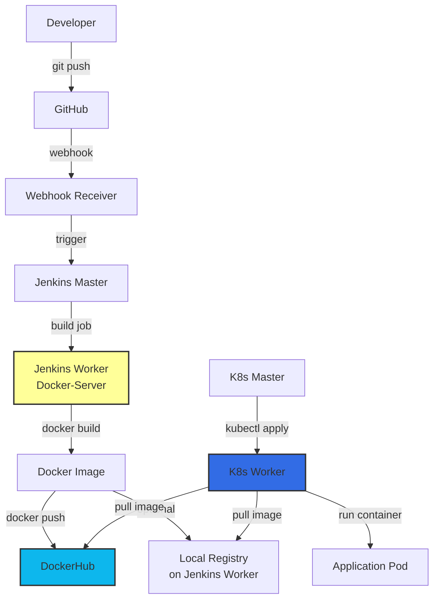
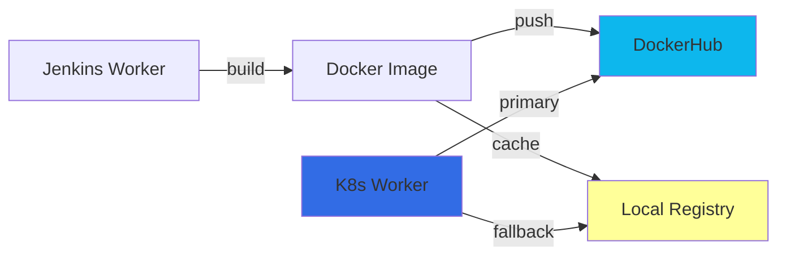

# Kubernetes & Docker Architecture - Image Pull Strategy

## 🏗️ **Infrastructure Overview**

Based on your `main.tf`, here's your server architecture:

| Server | Name | Purpose | Instance Type |
|--------|------|---------|---------------|
| **Jenkins Master** | Spring-Petclinic-Master | CI/CD orchestration | t2.large |
| **Jenkins Worker** | Spring-Petclinic-Worker | Docker builds, image registry | t2.large |
| **K8s Master** | K8s-Master-Server | Kubernetes control plane | t3.large |
| **K8s Worker** | K8s-Worker-Server | Runs application pods | t3.xlarge |
| **MySQL** | Spring-Petclinic-MySqlDB | Database server | t2.small |
| **Monitoring** | Spring-Petclinic-Moniter | Prometheus/Grafana | t2.small |
| **Webhook** | Webhook-Receiver-Server | GitHub webhooks | t2.large |

---

## 🔄 **Image Flow Architecture**



---

## 📋 **Two Image Pull Strategies**

### **Strategy 1: Pull from DockerHub** (Recommended for Production)

#### **Flow:**
1. Jenkins Worker builds Docker image
2. Jenkins Worker pushes to DockerHub
3. K8s Worker pulls from DockerHub
4. K8s Worker runs the container

#### **Advantages:**
- ✅ Images accessible from anywhere
- ✅ Built-in redundancy and CDN
- ✅ Easy to share across clusters
- ✅ No local infrastructure needed
- ✅ Automatic image versioning

#### **Configuration:**

**On Jenkins Worker (Docker-Server):**
```bash
# Build and push to DockerHub
docker build -t yourusername/customers-service:latest .
docker push yourusername/customers-service:latest
```

**Kubernetes Deployment YAML:**
```yaml
apiVersion: apps/v1
kind: Deployment
metadata:
  name: customers-service
spec:
  replicas: 2
  template:
    spec:
      containers:
      - name: customers-service
        image: yourusername/customers-service:latest
        imagePullPolicy: Always  # Always pull latest from DockerHub
```

---

### **Strategy 2: Pull from Jenkins Worker (Private Registry)**

#### **Flow:**
1. Jenkins Worker builds Docker image
2. Jenkins Worker runs as Docker registry
3. K8s Worker pulls from Jenkins Worker IP
4. K8s Worker runs the container

#### **Advantages:**
- ✅ No external dependencies
- ✅ Faster pulls (same VPC)
- ✅ Private images (no public exposure)
- ✅ No DockerHub rate limits
- ✅ Lower bandwidth costs

#### **Setup Required:**

**On Jenkins Worker (Docker-Server):**

```bash
# 1. Run Docker Registry
docker run -d \
  -p 5000:5000 \
  --restart=always \
  --name registry \
  -v /opt/registry:/var/lib/registry \
  registry:2

# 2. Configure insecure registry (if not using HTTPS)
sudo tee /etc/docker/daemon.json <<EOF
{
  "insecure-registries": ["<jenkins-worker-ip>:5000"]
}
EOF

sudo systemctl restart docker

# 3. Build and push to local registry
docker build -t <jenkins-worker-ip>:5000/customers-service:latest .
docker push <jenkins-worker-ip>:5000/customers-service:latest
```

**On K8s Worker:**

```bash
# Configure to trust insecure registry
sudo tee /etc/containerd/config.toml <<EOF
version = 2

[plugins."io.containerd.grpc.v1.cri".registry.mirrors]
  [plugins."io.containerd.grpc.v1.cri".registry.mirrors."<jenkins-worker-ip>:5000"]
    endpoint = ["http://<jenkins-worker-ip>:5000"]

[plugins."io.containerd.grpc.v1.cri".registry.configs]
  [plugins."io.containerd.grpc.v1.cri".registry.configs."<jenkins-worker-ip>:5000".tls]
    insecure_skip_verify = true
EOF

sudo systemctl restart containerd
```

**Kubernetes Deployment YAML:**
```yaml
apiVersion: apps/v1
kind: Deployment
metadata:
  name: customers-service
spec:
  replicas: 2
  template:
    spec:
      containers:
      - name: customers-service
        image: <jenkins-worker-ip>:5000/customers-service:latest
        imagePullPolicy: Always
```

---

## 🔐 **Network Connectivity Requirements**

### **Security Group Rules (Already Configured)**

Your security group allows all necessary ports:

```hcl
ingress_rules = [
  22,    # SSH
  80,    # HTTP
  443,   # HTTPS
  5000,  # Docker Registry (add this if using private registry)
  6443,  # Kubernetes API
  10250, # Kubelet API
]
```

### **Required Connectivity:**

| Source | Destination | Port | Purpose |
|--------|-------------|------|---------|
| K8s Worker | DockerHub | 443 | Pull images from DockerHub |
| K8s Worker | Jenkins Worker | 5000 | Pull from private registry |
| K8s Worker | K8s Master | 6443 | API server communication |
| K8s Master | K8s Worker | 10250 | Kubelet API |

---

## 🎯 **Recommended Architecture**

### **Hybrid Approach** (Best of Both Worlds)



**Benefits:**
- Primary: Pull from DockerHub (reliable, fast CDN)
- Fallback: Pull from local registry (if DockerHub is down)
- Cache: Local registry speeds up repeated deployments

---

## 📝 **Complete Setup Guide**

### **Option A: DockerHub Only** (Simplest)

#### **1. On Jenkins Worker:**

```bash
# Login to DockerHub
docker login

# Build image
docker build -t yourusername/customers-service:v1.0 .

# Push to DockerHub
docker push yourusername/customers-service:v1.0
```

#### **2. On K8s Master:**

```bash
# Create deployment
kubectl create deployment customers-service \
  --image=yourusername/customers-service:v1.0

# Or apply YAML
kubectl apply -f kubernetes/customers-service-deployment.yaml
```

#### **3. Kubernetes YAML:**

```yaml
apiVersion: apps/v1
kind: Deployment
metadata:
  name: customers-service
spec:
  replicas: 2
  selector:
    matchLabels:
      app: customers-service
  template:
    metadata:
      labels:
        app: customers-service
    spec:
      containers:
      - name: customers-service
        image: yourusername/customers-service:v1.0
        ports:
        - containerPort: 8081
        env:
        - name: SPRING_PROFILES_ACTIVE
          value: "docker"
```

---

### **Option B: Private Registry on Jenkins Worker**

#### **1. Setup Registry on Jenkins Worker:**

```bash
# Create registry directory
sudo mkdir -p /opt/registry

# Run registry container
docker run -d \
  -p 5000:5000 \
  --restart=always \
  --name registry \
  -v /opt/registry:/var/lib/registry \
  -e REGISTRY_STORAGE_DELETE_ENABLED=true \
  registry:2

# Verify registry is running
curl http://localhost:5000/v2/_catalog
```

#### **2. Configure K8s Worker to Trust Registry:**

```bash
# Get Jenkins Worker IP
JENKINS_WORKER_IP="10.0.1.50"  # Replace with actual IP

# Configure containerd
sudo mkdir -p /etc/containerd
sudo tee /etc/containerd/config.toml <<EOF
version = 2

[plugins."io.containerd.grpc.v1.cri".registry]
  [plugins."io.containerd.grpc.v1.cri".registry.mirrors]
    [plugins."io.containerd.grpc.v1.cri".registry.mirrors."${JENKINS_WORKER_IP}:5000"]
      endpoint = ["http://${JENKINS_WORKER_IP}:5000"]

  [plugins."io.containerd.grpc.v1.cri".registry.configs]
    [plugins."io.containerd.grpc.v1.cri".registry.configs."${JENKINS_WORKER_IP}:5000".tls]
      insecure_skip_verify = true
EOF

# Restart containerd
sudo systemctl restart containerd

# Verify
sudo crictl info | grep -A 10 registry
```

#### **3. Build and Push from Jenkins:**

```bash
# On Jenkins Worker
REGISTRY="10.0.1.50:5000"

# Build
docker build -t ${REGISTRY}/customers-service:v1.0 .

# Push
docker push ${REGISTRY}/customers-service:v1.0

# Verify
curl http://${REGISTRY}/v2/_catalog
```

#### **4. Deploy to Kubernetes:**

```yaml
apiVersion: apps/v1
kind: Deployment
metadata:
  name: customers-service
spec:
  replicas: 2
  selector:
    matchLabels:
      app: customers-service
  template:
    metadata:
      labels:
        app: customers-service
    spec:
      containers:
      - name: customers-service
        image: 10.0.1.50:5000/customers-service:v1.0
        imagePullPolicy: Always
        ports:
        - containerPort: 8081
```

---

## 🔍 **Troubleshooting Image Pulls**

### **Check if K8s Worker Can Pull Images:**

```bash
# On K8s Worker - test DockerHub
sudo crictl pull docker.io/library/nginx:latest

# On K8s Worker - test private registry
sudo crictl pull 10.0.1.50:5000/customers-service:v1.0

# Check containerd config
sudo crictl info | grep -A 20 registry
```

### **Common Issues:**

#### **1. ImagePullBackOff**

```bash
# Check pod events
kubectl describe pod <pod-name>

# Common causes:
# - Image doesn't exist
# - Wrong image name
# - Registry not accessible
# - Authentication required
```

#### **2. ErrImagePull**

```bash
# Check if registry is accessible from K8s Worker
curl http://<jenkins-worker-ip>:5000/v2/_catalog

# Check containerd logs
sudo journalctl -u containerd -f
```

#### **3. x509: certificate signed by unknown authority**

```bash
# Add insecure registry to containerd config
# See "Configure K8s Worker" section above
```

---

## 📊 **Image Pull Policy**

| Policy | Behavior | Use Case |
|--------|----------|----------|
| **Always** | Pull on every pod creation | Development, latest tags |
| **IfNotPresent** | Pull only if not cached | Production, versioned tags |
| **Never** | Never pull, use cached only | Testing, offline |

**Recommendation:**
- **Development**: `Always` (ensures latest code)
- **Production**: `IfNotPresent` with version tags (e.g., `v1.0.5`)

---

## 🚀 **Jenkins Pipeline Integration**

### **Jenkinsfile for Building and Pushing:**

```groovy
pipeline {
    agent { label 'docker' }
    
    environment {
        DOCKERHUB_CREDENTIALS = credentials('dockerhub')
        IMAGE_NAME = 'yourusername/customers-service'
        IMAGE_TAG = "${env.BUILD_NUMBER}"
        REGISTRY = '10.0.1.50:5000'  // Private registry
    }
    
    stages {
        stage('Build') {
            steps {
                sh 'mvn clean package -DskipTests'
            }
        }
        
        stage('Build Docker Image') {
            steps {
                sh """
                    docker build -t ${IMAGE_NAME}:${IMAGE_TAG} .
                    docker tag ${IMAGE_NAME}:${IMAGE_TAG} ${IMAGE_NAME}:latest
                """
            }
        }
        
        stage('Push to DockerHub') {
            steps {
                sh """
                    echo \$DOCKERHUB_CREDENTIALS_PSW | docker login -u \$DOCKERHUB_CREDENTIALS_USR --password-stdin
                    docker push ${IMAGE_NAME}:${IMAGE_TAG}
                    docker push ${IMAGE_NAME}:latest
                """
            }
        }
        
        stage('Push to Private Registry') {
            steps {
                sh """
                    docker tag ${IMAGE_NAME}:${IMAGE_TAG} ${REGISTRY}/customers-service:${IMAGE_TAG}
                    docker push ${REGISTRY}/customers-service:${IMAGE_TAG}
                """
            }
        }
        
        stage('Deploy to K8s') {
            steps {
                sh """
                    kubectl set image deployment/customers-service \
                        customers-service=${IMAGE_NAME}:${IMAGE_TAG}
                """
            }
        }
    }
}
```

---

## 💡 **Best Practices**

1. **Use Version Tags**: Never use `:latest` in production
2. **Multi-Stage Builds**: Reduce image size
3. **Image Scanning**: Scan for vulnerabilities
4. **Registry Mirroring**: Cache frequently used images
5. **Pull Secrets**: Use for private registries
6. **Resource Limits**: Set in deployments
7. **Health Checks**: Add liveness/readiness probes

---

## 📋 **Summary**

### **Your Architecture:**

```
GitHub → Webhook → Jenkins Master → Jenkins Worker (Docker-Server)
                                           ↓
                                    Build & Push Images
                                           ↓
                                    ┌──────┴──────┐
                                    ↓             ↓
                              DockerHub    Local Registry
                                    ↓             ↓
                                    └──────┬──────┘
                                           ↓
                                    K8s Worker pulls
                                           ↓
                                    Runs Application Pods
```

### **Recommended Setup:**

1. **Primary**: Push to DockerHub from Jenkins Worker
2. **Secondary**: Run local registry on Jenkins Worker as cache
3. **K8s**: Pull from DockerHub (with local registry as fallback)
4. **Network**: All servers in same VPC (10.0.0.0/16)
5. **Security**: Use image pull secrets for private images

This gives you reliability, speed, and flexibility! 🚀
